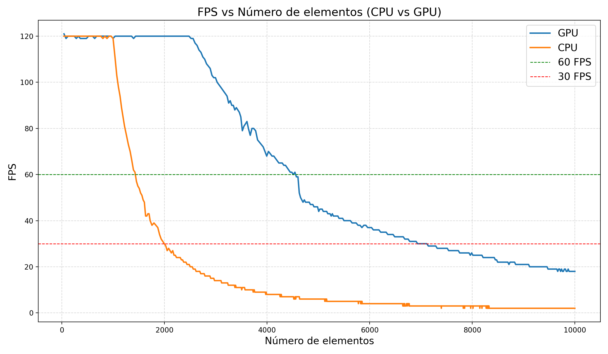
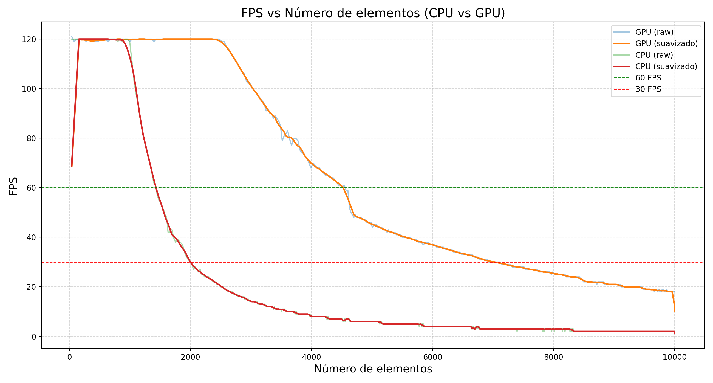
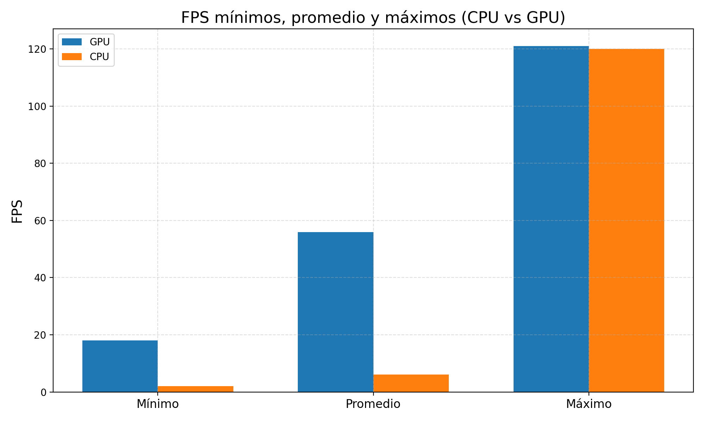

# Verlet CPU/GPU Physics Simulation

This project is a real-time 2D particle simulation written in C++ with SFML. It uses Verlet integration to spawn and animate thousands of circular particles inside a circular constraint, applying gravity, collision response and sub-stepping to keep the simulation stable. The goal of the project is not only to render an interactive physics scene, but also to compare a standard CPU solver with a CUDA-based GPU implementation under the same visual workload.

<p align="center">
  
</p>

The application can be launched in CPU or GPU mode through a command-line argument. Both implementations share the same `SolverBase` interface, which allows the renderer and the main loop to remain independent from the execution backend. The CPU solver performs the simulation directly in C++, while the GPU solver moves gravity, constraints, integration and collision correction into CUDA kernels.

## Performance comparison

The repository includes benchmark plots generated from recorded FPS and object-count data. During the simulation, particles are progressively added until the scene reaches a high object count, making it possible to observe how each implementation behaves as collision checks become more expensive.

<p align="center">
  
</p>

<p align="center">
  
</p>

<p align="center">
  
</p>

The GPU version accumulates collision corrections with CUDA atomics to avoid concurrent writes to the same particle position. This keeps the implementation close to the CPU version while exposing the main performance trade-off of the project: the collision phase is highly parallel, but the simulation still has synchronization and CPU/GPU transfer costs.

## Requirements

The project was built around C++17, SFML, CUDA and a Linux development environment. The manual build commands below assume that CUDA is installed under `/usr/local/cuda`, that SFML development libraries are available to the linker, and that GCC 12 is available as the host compiler for NVCC. The plotting script requires Python with `numpy` and `matplotlib`.

## Build

Compile the CUDA solver first:

```bash
nvcc -c solver_gpu.cu -o solver_gpu.o \
    -arch=sm_86 \
    -std=c++17 \
    --compiler-bindir=/usr/bin/gcc-12 \
    -Xcompiler "-O2 -Wno-narrowing" \
    -allow-unsupported-compiler
```

Then build the executable:

```bash
g++ main.cpp solver_gpu.o -o verlet_app \
    -lsfml-graphics -lsfml-window -lsfml-system \
    -lcudart \
    -L/usr/local/cuda/lib64 \
    -I/usr/local/cuda/include \
    -std=c++17 \
    -lm -O2
```

If you are using a different NVIDIA GPU, replace `sm_86` with the compute capability that matches your device. If your CUDA installation or compiler path is different, update the CUDA and GCC paths in the commands above.

## Run

Run the CPU solver with:

```bash
./verlet_app 0
```

Run the GPU solver with:

```bash
./verlet_app 1
```

The window title shows the active backend, current FPS and number of simulated objects. Press `Esc` or close the window to stop the simulation.

## Benchmark data and plots

The application writes FPS and object-count samples once per second. The current `main.cpp` writes to `resultados_cpu.txt`; when collecting GPU data, rename the generated file to `resultados_gpu.txt` or change the output filename before running the plotting script.

Install the Python dependencies and generate the plots with:

```bash
python3 -m pip install numpy matplotlib
python3 graficar.py
```

## Demo GIF

<p align="center">
  
</p>

## Project layout

`solver.hpp` contains the CPU implementation, `solver_gpu.cu` and `solver_gpu.hpp` contain the CUDA implementation, and `solver_base.hpp` defines the shared interface used by the application. Rendering is handled by `renderer.hpp`, while `graficar.py` generates the performance plots from the benchmark result files.

## License

This project is distributed under the terms described in `LICENSE.md`.
